# Agent System Guide - Complete Coordination Documentation

> **Comprehensive guide to agent coordination, specializations, and multi-phase operation orchestration**

## Table of Contents
1. [Agent Architecture Overview](#agent-architecture-overview)
2. [Core Agent Specifications](#core-agent-specifications)
3. [Agent Coordination Flows](#agent-coordination-flows)
4. [Conditional Activation Patterns](#conditional-activation-patterns)
5. [Multi-Agent Error Recovery](#multi-agent-error-recovery)
6. [Agent Configuration Management](#agent-configuration-management)

---

## Agent Architecture Overview

### System Design Principles

The agent system operates on a **specialist coordination model** where each agent has:

- **Clear Specialization**: Specific domain expertise and responsibilities
- **Conditional Activation**: Triggered by content patterns, workflow phases, or explicit requests
- **Handoff Protocols**: Defined interfaces for passing work between agents
- **Quality Gates**: Each agent enforces specific quality standards
- **Error Recovery**: Coordinated error handling and recovery procedures

### Agent Ecosystem Map


### Agent Activation Matrix

| QShortcut | Primary Agents | Conditional Agents | Triggers |
|-----------|---------------|-------------------|----------|
| **QNEW** | planner, docs-writer | - | Non-trivial feature requests |
| **QPLAN** | planner | - | Implementation planning phase |
| **QCODE** | test-writer | debugger | Test failures, implementation errors |
| **QCHECK** | PE-Reviewer | security-reviewer | Security-sensitive code patterns |
| **QCHECKF** | PE-Reviewer | - | Function-specific quality review |
| **QCHECKT** | PE-Reviewer, test-writer | - | Test-specific quality review |
| **QUX** | ux-tester | - | User experience validation |
| **QDOC** | docs-writer | - | Documentation updates |
| **QGIT** | release-manager | - | Commit and release validation |

---

## Core Agent Specifications

### planner Agent

**Role**: Requirements analysis, implementation strategy, and architectural consistency.

#### Core Responsibilities
1. **Requirements Extraction**: Parse feature requests into structured REQ-IDs
2. **Codebase Analysis**: Identify existing patterns and integration points
3. **Implementation Strategy**: Recommend approaches that maintain consistency
4. **Dependency Mapping**: Identify requirements dependencies and blockers

#### Activation Patterns
```typescript
// Triggers planner activation
const plannerTriggers = [
  'QNEW',
  'QPLAN',
  'complex feature requests',
  'architectural decisions',
  'cross-module integration'
];
```

#### Example planner Output
```markdown
# PLANNER ANALYSIS - Password Reset Feature

## Requirements Extraction
- REQ-401: Password reset request flow
- REQ-402: Token security and validation
- REQ-403: Password change completion

## Codebase Analysis
✅ Existing Components:
- src/services/email.js - EmailService with template support
- src/auth/tokens.js - TokenService (needs extension)
- src/middleware/rateLimit.js - Rate limiting available
- src/models/User.js - User model with password methods

## Implementation Strategy
1. **Phase 1**: Extend TokenService for reset tokens (REQ-402)
2. **Phase 2**: Create PasswordResetController (REQ-401)
3. **Phase 3**: Add completion endpoint (REQ-403)

## Consistency Validation
✅ Follows existing auth patterns
✅ Reuses email infrastructure
✅ Maintains error handling standards
✅ Integrates with current middleware stack

## Recommendations
- Use existing RateLimitMiddleware
- Follow JWT token patterns for consistency
- Reuse EmailService template system
- Maintain error response format standards
```

#### Configuration Example
```markdown
<!-- .claude/agents/planner.md -->
# Planner Agent

## Role
Requirements analysis and implementation planning specialist.

## Activation Triggers
- QNEW workflow initiation
- QPLAN explicit planning requests
- Complex feature requests requiring architectural analysis
- Cross-module integration requirements

## Analysis Framework
1. Requirements parsing and REQ-ID extraction
2. Existing codebase pattern analysis
3. Implementation approach recommendation
4. Architectural consistency validation
5. Dependency and integration mapping

## Output Format
- Structured requirements with REQ-IDs
- Implementation phase breakdown
- Consistency validation results
- Risk assessment and recommendations

## Integration Points
- Hands off to docs-writer for requirements.lock.md creation
- Coordinates with test-writer for comprehensive test planning
- Informs PE-Reviewer of architectural constraints
```

### test-writer Agent

**Role**: TDD enforcement, test generation, and test quality validation.

#### Core Responsibilities
1. **Failing Test Generation**: Create tests that fail before implementation
2. **REQ-ID Coverage**: Ensure every requirement has corresponding tests
3. **Test Quality Validation**: Apply 11-point testing checklist
4. **TDD Gate Enforcement**: Block implementation until tests fail properly

#### Activation Logic
```typescript
class TestWriterAgent {
  shouldActivate(context: WorkflowContext): boolean {
    return (
      context.workflow === 'QCODE' ||
      context.hasNewRequirements ||
      context.hasAPIChanges ||
      this.hasMissingTestCoverage(context)
    );
  }

  async generateTests(requirements: Requirement[]): Promise<TestSuite> {
    const tests = [];

    for (const req of requirements) {
      const testCases = await this.generateTestCasesForRequirement(req);
      const validatedTests = this.validateTestQuality(testCases);
      tests.push(...validatedTests);
    }

    return this.enforceFailingTests(tests);
  }

  private validateTestQuality(tests: TestCase[]): TestCase[] {
    return tests.filter(test => {
      const issues = this.applyElevenPointChecklist(test);
      if (issues.length > 0) {
        this.reportQualityIssues(test, issues);
        return false;
      }
      return true;
    });
  }
}
```

#### Example test-writer Output
```typescript
// Generated by test-writer agent
// REQ-401: Password Reset Request Flow
describe('PasswordResetService', () => {
  test('REQ-401 — sends reset email to verified user', async () => {
    // Arrange
    const verifiedUser = { id: 1, email: 'user@example.com', verified: true };
    vi.spyOn(userService, 'findByEmail').mockResolvedValue(verifiedUser);
    vi.spyOn(emailService, 'sendResetEmail').mockResolvedValue(true);

    // Act
    const result = await passwordResetService.requestReset('user@example.com');

    // Assert
    expect(result.success).toBe(true);
    expect(emailService.sendResetEmail).toHaveBeenCalledWith(
      'user@example.com',
      expect.stringMatching(/^[a-f0-9]{64}$/) // 256-bit token
    );
  });

  test('REQ-401 — returns success even for non-existent email (security)', async () => {
    // Arrange
    vi.spyOn(userService, 'findByEmail').mockResolvedValue(null);

    // Act
    const result = await passwordResetService.requestReset('unknown@example.com');

    // Assert
    expect(result.success).toBe(true);
    expect(result.message).toBe('Reset link sent to email');
    // Security: Don't reveal email existence
  });
});

// TDD ENFORCEMENT CHECK
// Running tests to verify they fail...
// ❌ REQ-401 — sends reset email to verified user
//    TypeError: passwordResetService.requestReset is not a function
// ✅ Tests fail as expected - implementation can proceed
```

### PE-Reviewer Agent

**Role**: Code quality analysis using 8-point function checklist and best practice enforcement.

#### 8-Point Function Quality Analysis
```typescript
class PEReviewerAgent {
  async reviewFunction(functionCode: string, functionName: string): Promise<ReviewResult> {
    const analysis = {
      readability: this.assessReadability(functionCode),
      cyclomaticComplexity: this.calculateComplexity(functionCode),
      dataStructures: this.analyzeDataStructures(functionCode),
      unusedParameters: this.findUnusedParameters(functionCode),
      typeCasts: this.analyzeTypeCasts(functionCode),
      testability: this.assessTestability(functionCode),
      dependencies: this.analyzeDependencies(functionCode),
      naming: this.evaluateNaming(functionName, functionCode)
    };

    return this.generateReviewReport(analysis);
  }

  private assessReadability(code: string): ReadabilityScore {
    // 1. Can you read the function and HONESTLY easily follow what it's doing?
    const metrics = {
      lineCount: this.countLines(code),
      nestingDepth: this.calculateNestingDepth(code),
      commentRatio: this.calculateCommentRatio(code),
      singleResponsibility: this.checkSingleResponsibility(code)
    };

    return {
      score: this.calculateReadabilityScore(metrics),
      issues: this.identifyReadabilityIssues(metrics),
      recommendations: this.generateReadabilityRecommendations(metrics)
    };
  }

  private calculateComplexity(code: string): ComplexityAnalysis {
    // 2. Cyclomatic complexity analysis
    const complexity = this.parseCyclomaticComplexity(code);

    return {
      score: complexity,
      threshold: 10, // Recommended maximum
      status: complexity <= 10 ? 'PASS' : 'FAIL',
      suggestions: complexity > 10 ? [
        'Consider extracting functions',
        'Reduce branching logic',
        'Use lookup tables for complex conditionals'
      ] : []
    };
  }
}
```

#### Example PE-Reviewer Analysis
```typescript
// PE-REVIEWER ANALYSIS REPORT

function processUserOrder(user, order, options) {
  // ... function implementation
}

// 8-POINT QUALITY ASSESSMENT:

✅ 1. Readability: Function is clear and follows single responsibility
   - 15 lines of code (within reasonable limit)
   - Clear variable names
   - Logical flow without excessive nesting

✅ 2. Cyclomatic Complexity: 6 (acceptable, threshold: 10)
   - Linear flow with 2 conditional branches
   - No deeply nested logic

✅ 3. Data Structures: Appropriate use of domain objects
   - Uses proper TypeScript interfaces
   - No primitive obsession detected

❌ 4. Unused Parameters: 'options' parameter not used
   - Remove unused parameter or implement options handling
   - Consider default parameters if optional

✅ 5. Type Casts: No unnecessary type assertions
   - TypeScript types are explicit and safe

✅ 6. Testability: Function is easily testable
   - Pure inputs and outputs
   - Dependencies are injected
   - No hidden side effects

⚠️  7. Dependencies: One hidden dependency detected
   - Direct access to global 'config' object
   - Recommendation: Inject config as parameter

✅ 8. Naming: Function and variable names are clear
   - Follows domain vocabulary
   - Consistent with codebase patterns

OVERALL SCORE: 7.5/8 (Good)
BLOCKING ISSUES: None
RECOMMENDATIONS: Remove unused parameter, inject config dependency
```

### security-reviewer Agent

**Role**: Security analysis for authentication, networking, filesystem, templates, database, and cryptographic operations.

#### Activation Pattern Detection
```typescript
class SecurityReviewerAgent {
  private securityPatterns = {
    authentication: [
      /password/i,
      /token/i,
      /login/i,
      /session/i,
      /auth/i,
      /credential/i,
      /jwt/i
    ],
    network: [
      /fetch\s*\(/,
      /axios\./,
      /http\./,
      /request\s*\(/,
      /url\s*=/,
      /endpoint/i
    ],
    filesystem: [
      /fs\./,
      /readFile/,
      /writeFile/,
      /path\./,
      /upload/i,
      /file\s*=/
    ],
    templates: [
      /innerHTML/,
      /dangerouslySetInnerHTML/,
      /template/i,
      /render/i,
      /\$\{.*\}/,
      /html\s*=/
    ],
    database: [
      /query\s*\(/,
      /execute\s*\(/,
      /sql/i,
      /SELECT|INSERT|UPDATE|DELETE/i,
      /knex\.|prisma\.|db\./
    ],
    crypto: [
      /crypto\./,
      /hash/i,
      /encrypt/i,
      /decrypt/i,
      /random/i,
      /bcrypt/,
      /scrypt/
    ]
  };

  shouldActivate(codeChanges: CodeChange[]): boolean {
    return codeChanges.some(change =>
      this.detectSecurityPatterns(change.content)
    );
  }

  private detectSecurityPatterns(code: string): boolean {
    return Object.values(this.securityPatterns)
      .flat()
      .some(pattern => pattern.test(code));
  }
}
```

#### Security Analysis Framework
```typescript
// SECURITY REVIEWER ANALYSIS

class SecurityAnalysis {
  async analyzeCode(code: string): Promise<SecurityReport> {
    const findings = [];

    // Authentication Security
    if (this.hasAuthPatterns(code)) {
      findings.push(...this.analyzeAuthentication(code));
    }

    // Input Validation
    if (this.hasUserInput(code)) {
      findings.push(...this.analyzeInputValidation(code));
    }

    // Cryptographic Implementation
    if (this.hasCryptoPatterns(code)) {
      findings.push(...this.analyzeCryptography(code));
    }

    // SQL Injection
    if (this.hasDatabaseQueries(code)) {
      findings.push(...this.analyzeSQLInjection(code));
    }

    // XSS Prevention
    if (this.hasTemplateRendering(code)) {
      findings.push(...this.analyzeXSSPrevention(code));
    }

    return this.generateSecurityReport(findings);
  }

  private analyzeCryptography(code: string): SecurityFinding[] {
    const findings = [];

    // Check for weak random number generation
    if (/Math\.random\(\)/.test(code)) {
      findings.push({
        severity: 'HIGH',
        type: 'WEAK_RANDOMNESS',
        description: 'Math.random() is not cryptographically secure',
        recommendation: 'Use crypto.randomBytes() for security-sensitive operations',
        line: this.findLineNumber(code, /Math\.random\(\)/)
      });
    }

    // Check for proper token generation
    if (/crypto\.randomBytes/.test(code)) {
      findings.push({
        severity: 'INFO',
        type: 'GOOD_PRACTICE',
        description: 'Using cryptographically secure random number generation',
        line: this.findLineNumber(code, /crypto\.randomBytes/)
      });
    }

    // Check for password storage
    if (/password.*=.*['"]\w+['"]/.test(code)) {
      findings.push({
        severity: 'CRITICAL',
        type: 'HARDCODED_PASSWORD',
        description: 'Hardcoded password detected',
        recommendation: 'Use environment variables or secure configuration',
        line: this.findLineNumber(code, /password.*=.*['"]\w+['"]/)
      });
    }

    return findings;
  }
}
```

#### Example security-reviewer Report
```markdown
# SECURITY REVIEW REPORT

## Activation Trigger
Detected cryptographic operations and authentication patterns in code changes.

## Security Analysis

### 🛡️ CRYPTOGRAPHY REVIEW
✅ **Token Generation**: Uses crypto.randomBytes(32) - cryptographically secure
✅ **Token Length**: 256-bit tokens provide adequate entropy
✅ **Password Hashing**: Uses bcrypt with appropriate cost factor (12)

⚠️  **Token Storage**: In-memory Map not suitable for production
   - **Risk**: Tokens lost on server restart
   - **Recommendation**: Use Redis or database with TTL

### 🔒 AUTHENTICATION SECURITY
✅ **Session Management**: Properly terminates sessions on password change
✅ **Rate Limiting**: Implements 5 requests per 15 minutes
✅ **Information Disclosure**: Doesn't reveal email existence in responses

❌ **HTTPS Enforcement**: No HTTPS-only requirement detected
   - **Risk**: Tokens could be intercepted over HTTP
   - **Recommendation**: Add HTTPS-only middleware
   - **Priority**: HIGH

### 🔍 INPUT VALIDATION
✅ **Email Validation**: Uses proper regex for email format
✅ **Password Complexity**: Enforces strong password requirements

⚠️  **SQL Injection**: Using parameterized queries (good practice)
   - **Note**: Verify all database interactions use parameters

### 📊 SECURITY SCORE: 8.2/10

**Blocking Issues**: HTTPS enforcement required for production
**Recommendations**:
1. Implement Redis token storage
2. Add HTTPS-only middleware
3. Consider additional entropy sources

**Approval Status**: ✅ APPROVED with recommendations
```

### docs-writer Agent

**Role**: Technical writing, README updates, CHANGELOG generation, and requirements snapshots.

#### Core Capabilities
```typescript
class DocsWriterAgent {
  async updateDocumentation(context: DocumentationContext): Promise<void> {
    // Generate requirements snapshot
    if (context.workflow === 'QNEW') {
      await this.createRequirementsSnapshot(context.requirements);
    }

    // Update API documentation
    if (context.hasAPIChanges) {
      await this.updateAPIDocumentation(context.apiChanges);
    }

    // Update README sections
    if (context.hasArchitecturalChanges) {
      await this.updateArchitectureDocumentation(context.changes);
    }

    // Generate CHANGELOG entries
    if (context.workflow === 'QDOC') {
      await this.generateChangelogEntry(context.commits, context.requirements);
    }
  }

  private async createRequirementsSnapshot(requirements: Requirement[]): Promise<void> {
    const snapshot = {
      timestamp: new Date().toISOString(),
      requirements: requirements.map(req => ({
        id: req.id,
        title: req.title,
        acceptance: req.acceptance,
        dependencies: req.dependencies,
        notes: req.notes
      }))
    };

    await this.writeFile('requirements/requirements.lock.md',
      this.formatRequirementsDocument(snapshot)
    );
  }
}
```

### debugger Agent

**Role**: Error resolution, troubleshooting assistance, and performance optimization.

#### Activation Triggers
```typescript
const debuggerTriggers = [
  'test failures',
  'build errors',
  'type checking errors',
  'runtime exceptions',
  'performance regressions',
  'integration failures'
];
```

#### Diagnostic Capabilities
```typescript
class DebuggerAgent {
  async analyzeFailure(error: Error, context: DebugContext): Promise<DiagnosticReport> {
    const diagnostics = {
      errorType: this.classifyError(error),
      stackTrace: this.parseStackTrace(error.stack),
      contextAnalysis: this.analyzeContext(context),
      suggestedFixes: await this.generateFixes(error, context),
      reproductionSteps: this.generateReproductionSteps(context)
    };

    return this.formatDiagnosticReport(diagnostics);
  }

  private classifyError(error: Error): ErrorClassification {
    if (error.name === 'TypeError') {
      return {
        category: 'TYPE_ERROR',
        severity: 'HIGH',
        commonCauses: [
          'Undefined function or property',
          'Incorrect object structure',
          'Missing import',
          'Async/await misuse'
        ]
      };
    }
    // ... other error classifications
  }
}
```

---

## Agent Coordination Flows

### Sequential Coordination (QNEW → QGIT)

```mermaid
sequenceDiagram
    participant Dev as Developer
    participant P as planner
    participant DW as docs-writer
    participant TW as test-writer
    participant PE as PE-Reviewer
    participant SR as security-reviewer
    participant D as debugger
    participant RM as release-manager

    Dev->>P: QNEW "Password reset feature"
    P->>P: Extract REQ-IDs, analyze requirements
    P->>DW: Handoff requirements structure
    DW->>DW: Create requirements.lock.md
    DW-->>Dev: ✅ Requirements documented

    Dev->>P: QPLAN
    P->>P: Analyze codebase patterns
    P-->>Dev: ✅ Implementation strategy

    Dev->>TW: QCODE
    TW->>TW: Generate failing tests for REQ-IDs
    TW->>TW: Run tests, verify failures
    TW-->>Dev: ✅ TDD gate passed, implement

    Note over Dev: Implementation phase

    Dev->>TW: Re-run tests
    alt Tests pass
        TW-->>Dev: ✅ Implementation complete
    else Tests fail
        TW->>D: Handoff test failures
        D->>D: Analyze failures, suggest fixes
        D-->>Dev: 🔧 Debug assistance
    end

    Dev->>PE: QCHECK
    PE->>PE: Apply 8-point function analysis

    alt Security patterns detected
        PE->>SR: Handoff for security review
        SR->>SR: Security analysis
        SR-->>PE: Security assessment
    end

    PE-->>Dev: ✅ Quality review complete

    Dev->>DW: QDOC
    DW->>DW: Update documentation from diffs
    DW-->>Dev: ✅ Documentation updated

    Dev->>RM: QGIT
    RM->>RM: Validate all quality gates
    RM->>RM: Generate commit message
    RM-->>Dev: ✅ Changes committed
```



### Parallel Coordination (Multi-Agent Analysis)


### Error Recovery Coordination


---

## Conditional Activation Patterns

### security-reviewer Activation Logic

```typescript
class SecurityActivationEngine {
  private securityTriggerPatterns = {
    // Authentication patterns
    auth: [
      /password.*(?:hash|verify|check)/i,
      /token.*(?:generate|verify|validate)/i,
      /session.*(?:create|destroy|validate)/i,
      /login|logout|authenticate/i,
      /jwt|bearer|oauth/i
    ],

    // Network security patterns
    network: [
      /fetch\s*\(\s*[^)]*\$\{/,  // Dynamic URLs
      /axios\.[^(]*\([^)]*\$\{/, // Parameterized requests
      /http[s]?:\/\/[^"']*\$\{/, // URL injection
      /cors|proxy|redirect/i
    ],

    // File system patterns
    filesystem: [
      /fs\.\w+.*\$\{/,           // Dynamic file paths
      /path\.join.*\$\{/,        // Path injection
      /upload.*filename/i,        // File uploads
      /\.\.\/|\.\.\\\/i          // Path traversal
    ],

    // Template rendering patterns
    templates: [
      /innerHTML.*\$\{/,         // XSS potential
      /dangerouslySetInnerHTML/, // React XSS
      /render.*\$\{.*\}/,        // Template injection
      /eval\s*\(/,               // Code injection
      /<script/i                 // Script injection
    ],

    // Database patterns
    database: [
      /query.*\$\{/,             // SQL injection
      /sql.*\+.*\$\{/,           // String concatenation
      /SELECT.*\$\{/i,           // Dynamic SQL
      /INSERT.*VALUES.*\$\{/i,   // Dynamic INSERT
      /WHERE.*\$\{/i             // Dynamic WHERE clauses
    ],

    // Cryptographic patterns
    crypto: [
      /crypto\.random/,          // Crypto operations
      /bcrypt|scrypt|argon/,     // Password hashing
      /encrypt|decrypt/i,        // Encryption
      /private.*key|public.*key/i, // Key handling
      /certificate|cert/i        // Certificate handling
    ]
  };

  shouldActivate(codeChanges: CodeChange[]): ActivationDecision {
    const triggers = [];

    for (const change of codeChanges) {
      const detectedPatterns = this.detectPatterns(change.content);
      if (detectedPatterns.length > 0) {
        triggers.push({
          file: change.file,
          patterns: detectedPatterns,
          riskLevel: this.assessRiskLevel(detectedPatterns),
          requiredAnalysis: this.getRequiredAnalysis(detectedPatterns)
        });
      }
    }

    return {
      shouldActivate: triggers.length > 0,
      triggers,
      priority: this.calculatePriority(triggers)
    };
  }

  private detectPatterns(code: string): SecurityPattern[] {
    const detected = [];

    for (const [category, patterns] of Object.entries(this.securityTriggerPatterns)) {
      for (const pattern of patterns) {
        if (pattern.test(code)) {
          detected.push({
            category,
            pattern: pattern.source,
            line: this.findLineNumber(code, pattern),
            context: this.extractContext(code, pattern)
          });
        }
      }
    }

    return detected;
  }
}
```

### debugger Conditional Activation

```typescript
class DebuggerActivationEngine {
  private errorPatterns = {
    testFailures: /Test failed|AssertionError|expect.*received/i,
    buildErrors: /SyntaxError|TypeError.*import|Module not found/i,
    typeErrors: /Type.*is not assignable|Property.*does not exist/i,
    runtimeErrors: /ReferenceError|Cannot read property|undefined is not a function/i,
    performanceIssues: /timeout|slow|performance|memory/i
  };

  shouldActivate(context: DebugContext): boolean {
    return (
      context.hasTestFailures ||
      context.hasBuildErrors ||
      context.hasTypeErrors ||
      context.hasRuntimeErrors ||
      this.detectPerformanceIssues(context)
    );
  }

  generateDiagnostics(error: Error, context: DebugContext): DiagnosticPlan {
    const errorType = this.classifyError(error);

    return {
      immediate: this.getImmediateActions(errorType),
      investigation: this.getInvestigationSteps(errorType, context),
      prevention: this.getPreventionStrategies(errorType),
      escalation: this.getEscalationPath(errorType)
    };
  }
}
```

---

## Multi-Agent Error Recovery

### Coordinated Error Resolution Process

```typescript
class ErrorRecoveryCoordinator {
  async handleError(error: WorkflowError, context: WorkflowContext): Promise<RecoveryResult> {
    const recoveryPlan = await this.createRecoveryPlan(error, context);

    // Activate appropriate agents based on error type
    const activeAgents = this.selectAgentsForRecovery(error);

    // Coordinate recovery efforts
    const recoveryResults = await Promise.all(
      activeAgents.map(agent => agent.handleError(error, context))
    );

    // Consolidate and validate recovery
    return this.consolidateRecovery(recoveryResults);
  }

  private selectAgentsForRecovery(error: WorkflowError): Agent[] {
    const agents = [];

    switch (error.type) {
      case 'TEST_FAILURE':
        agents.push(this.debugger, this.testWriter);
        break;

      case 'SECURITY_VULNERABILITY':
        agents.push(this.securityReviewer, this.debugger);
        break;

      case 'QUALITY_GATE_FAILURE':
        agents.push(this.peReviewer, this.debugger);
        break;

      case 'BUILD_FAILURE':
        agents.push(this.debugger);
        if (error.details.includes('type')) {
          // TypeScript errors might need code review
          agents.push(this.peReviewer);
        }
        break;

      case 'INTEGRATION_FAILURE':
        agents.push(this.debugger, this.peReviewer);
        break;
    }

    return agents;
  }
}
```

### Error Recovery Workflows

#### Test Failure Recovery


#### Security Issue Recovery


### Agent Communication Protocols

#### Handoff Protocol
```typescript
interface AgentHandoff {
  fromAgent: AgentType;
  toAgent: AgentType;
  context: HandoffContext;
  data: HandoffData;
  priority: 'LOW' | 'MEDIUM' | 'HIGH' | 'CRITICAL';
}

class AgentCommunication {
  async handoff(handoff: AgentHandoff): Promise<HandoffResult> {
    // Validate handoff
    this.validateHandoff(handoff);

    // Notify receiving agent
    const receivingAgent = this.getAgent(handoff.toAgent);
    await receivingAgent.receiveHandoff(handoff);

    // Update workflow state
    this.updateWorkflowState(handoff);

    // Log handoff for audit
    this.logHandoff(handoff);

    return {
      success: true,
      timestamp: new Date(),
      acknowledgment: await receivingAgent.acknowledgeHandoff(handoff)
    };
  }
}
```

#### Conflict Resolution
```typescript
class AgentConflictResolver {
  async resolveConflicts(conflicts: AgentConflict[]): Promise<ResolutionResult> {
    for (const conflict of conflicts) {
      const resolution = await this.resolveConflict(conflict);
      await this.implementResolution(resolution);
    }

    return {
      resolved: conflicts.length,
      resolutions: conflicts.map(c => c.resolution)
    };
  }

  private async resolveConflict(conflict: AgentConflict): Promise<ConflictResolution> {
    // Priority order: security > quality > performance
    const priorityOrder = [
      'security-reviewer',
      'PE-Reviewer',
      'test-writer',
      'debugger',
      'docs-writer',
      'planner'
    ];

    const sortedAgents = conflict.agents.sort((a, b) => {
      return priorityOrder.indexOf(a) - priorityOrder.indexOf(b);
    });

    // Highest priority agent wins
    return {
      winningAgent: sortedAgents[0],
      decision: conflict.decisions[sortedAgents[0]],
      rationale: `${sortedAgents[0]} has priority in this domain`,
      overriddenAgents: sortedAgents.slice(1)
    };
  }
}
```

---

## Agent Configuration Management

### Agent Definition Files

Each agent is defined in `.claude/agents/{agent-name}.md`:

#### Example: security-reviewer.md
```markdown
# Security Reviewer Agent

## Role
Specialized security analysis for authentication, networking, filesystem, templates, database, and cryptographic operations.

## Activation Triggers
### Automatic Patterns
- Authentication: `password`, `token`, `login`, `session`, `auth`, `jwt`
- Network: Dynamic URLs, CORS, proxies, redirects
- Filesystem: File operations, uploads, path handling
- Templates: innerHTML, dangerouslySetInnerHTML, template injection
- Database: SQL queries, dynamic query building
- Cryptography: crypto operations, hashing, encryption

### Manual Activation
- QCHECK when security-sensitive code detected
- Explicit request: "security-reviewer please analyze..."

## Analysis Framework
1. **Input Validation**: Check for proper sanitization
2. **Output Encoding**: Verify safe rendering/output
3. **Authentication**: Validate auth mechanisms
4. **Authorization**: Check access controls
5. **Cryptography**: Review crypto implementations
6. **Error Handling**: Prevent information disclosure
7. **Rate Limiting**: Verify DoS protections
8. **Injection Prevention**: SQL, XSS, code injection checks
9. **Secure Configuration**: Review security settings

## Severity Classifications
- **CRITICAL**: Immediate security threat (hardcoded secrets, SQL injection)
- **HIGH**: Significant security risk (weak crypto, XSS potential)
- **MEDIUM**: Security concern (missing rate limiting, weak validation)
- **LOW**: Best practice recommendation (HTTPS enforcement)

## Integration Points
- Activates during QCHECK for security-sensitive changes
- Coordinates with PE-Reviewer for comprehensive analysis
- Hands off to debugger for implementation assistance
- Blocks workflow progression if critical issues found

## Output Format
- Risk assessment with severity levels
- Specific vulnerability descriptions
- Actionable remediation steps
- Code examples for fixes
- Security best practice recommendations
```

### Dynamic Agent Configuration

```typescript
// .claude/config/agent-config.ts
interface AgentConfiguration {
  agents: {
    [agentName: string]: {
      enabled: boolean;
      activationThresholds: {
        [trigger: string]: number;
      };
      integrations: string[];
      specializations: string[];
    };
  };
  workflows: {
    [workflow: string]: {
      requiredAgents: string[];
      optionalAgents: string[];
      qualityGates: string[];
    };
  };
}

const agentConfig: AgentConfiguration = {
  agents: {
    'security-reviewer': {
      enabled: true,
      activationThresholds: {
        cryptoPatterns: 1,      // Activate on any crypto pattern
        authPatterns: 2,        // Activate on 2+ auth patterns
        networkPatterns: 3      // Activate on 3+ network patterns
      },
      integrations: ['PE-Reviewer', 'debugger'],
      specializations: ['authentication', 'cryptography', 'network-security']
    },
    'test-writer': {
      enabled: true,
      activationThresholds: {
        newFeatures: 1,         // Always for new features
        apiChanges: 1,          // Always for API changes
        missingCoverage: 0.8    // If coverage below 80%
      },
      integrations: ['debugger', 'PE-Reviewer'],
      specializations: ['tdd-enforcement', 'test-quality', 'coverage-analysis']
    }
  },
  workflows: {
    'QCODE': {
      requiredAgents: ['test-writer'],
      optionalAgents: ['debugger'],
      qualityGates: ['tests-fail-first', 'implementation-complete', 'tests-pass']
    },
    'QCHECK': {
      requiredAgents: ['PE-Reviewer'],
      optionalAgents: ['security-reviewer'],
      qualityGates: ['function-quality', 'security-analysis', 'best-practices']
    }
  }
};
```

### Environment-Specific Agent Behavior

```typescript
// Development environment
const developmentConfig = {
  'debugger': {
    verbosity: 'high',
    includeStackTraces: true,
    suggestQuickFixes: true
  },
  'test-writer': {
    generateMockData: true,
    includeBrowserTests: false,
    fastCheckRuns: 50  // Fewer property-based test runs
  }
};

// Production environment
const productionConfig = {
  'security-reviewer': {
    strictMode: true,
    blockOnMediumSeverity: true,
    requireApprovalForCrypto: true
  },
  'release-manager': {
    requireCodeReview: true,
    enforceVersioning: true,
    validateCI: true
  }
};
```

This comprehensive Agent System Guide provides everything needed to understand, configure, and coordinate the agent ecosystem for optimal development workflow automation.