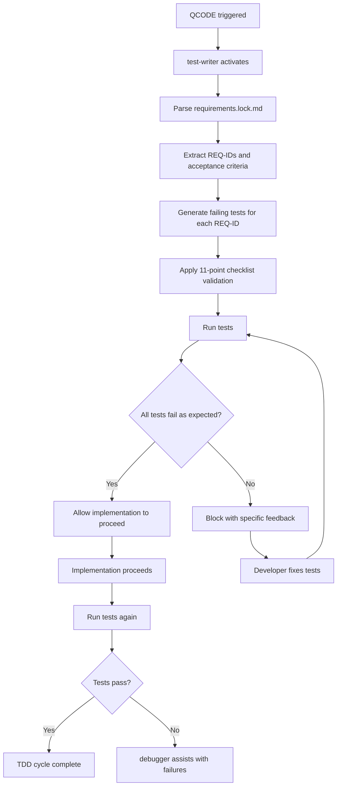

# Testing Framework Guide - Comprehensive Testing Best Practices

> **Complete guide to implementing the 11-point testing checklist with TDD enforcement and property-based testing**

## Table of Contents
1. [11-Point Testing Checklist](#11-point-testing-checklist)
2. [Property-Based Testing with fast-check](#property-based-testing-with-fast-check)
3. [TDD Enforcement Integration](#tdd-enforcement-integration)
4. [Advanced Testing Patterns](#advanced-testing-patterns)
5. [Test Quality Validation](#test-quality-validation)
6. [Common Testing Anti-Patterns](#common-testing-anti-patterns)

---

## 11-Point Testing Checklist

### 1. Parameterized Inputs

**Rule**: SHOULD parameterize inputs; never embed unexplained literals such as 42 or "foo" directly in the test.

#### ❌ Bad Examples
```typescript
test('calculates discount', () => {
  expect(calculateDiscount(100, 0.1)).toBe(90);
  expect(calculateTax(50, 0.08)).toBe(54);
  expect(formatCurrency(123.45)).toBe('$123.45');
});

test('validates email', () => {
  expect(isValidEmail('test@example.com')).toBe(true);
  expect(isValidEmail('invalid')).toBe(false);
});
```

#### ✅ Good Examples
```typescript
test('REQ-101 — calculates discount correctly', () => {
  const originalPrice = 100;
  const discountRate = 0.1;
  const expectedDiscountedPrice = 90;

  const result = calculateDiscount(originalPrice, discountRate);
  expect(result).toBe(expectedDiscountedPrice);
});

test('REQ-102 — calculates tax on subtotal', () => {
  const subtotal = 50;
  const taxRate = 0.08;
  const expectedTotal = 54;

  const result = calculateTax(subtotal, taxRate);
  expect(result).toBe(expectedTotal);
});

test('REQ-103 — formats currency with dollar sign', () => {
  const amount = 123.45;
  const expectedFormat = '$123.45';

  const result = formatCurrency(amount);
  expect(result).toBe(expectedFormat);
});

test('REQ-104 — validates well-formed email addresses', () => {
  const validEmail = 'user@example.com';
  const invalidEmail = 'not-an-email';

  expect(isValidEmail(validEmail)).toBe(true);
  expect(isValidEmail(invalidEmail)).toBe(false);
});
```

#### Advanced Parameterization
```typescript
// Use test.each for multiple parameter sets
describe('calculateShipping', () => {
  test.each([
    { weight: 1, distance: 100, expected: 5.99 },
    { weight: 5, distance: 100, expected: 12.99 },
    { weight: 1, distance: 500, expected: 8.99 },
    { weight: 10, distance: 1000, expected: 25.99 }
  ])('REQ-105 — calculates shipping for $weight lbs over $distance miles', ({ weight, distance, expected }) => {
    const shippingCost = calculateShipping(weight, distance);
    expect(shippingCost).toBe(expected);
  });
});
```

### 2. Real Defect Testing

**Rule**: SHOULD NOT add a test unless it can fail for a real defect. Trivial asserts (e.g., expect(2).toBe(2)) are forbidden.

#### ❌ Bad Examples
```typescript
test('returns a number', () => {
  const result = calculateDiscount(100, 0.1);
  expect(typeof result).toBe('number'); // Type checker handles this
});

test('returns truthy value', () => {
  const result = getUserProfile('user123');
  expect(result).toBeTruthy(); // Too vague
});

test('constant value', () => {
  expect(2 + 2).toBe(4); // Will never fail meaningfully
});
```

#### ✅ Good Examples
```typescript
test('REQ-201 — applies discount only to eligible items', () => {
  const eligibleItem = { price: 100, category: 'electronics' };
  const ineligibleItem = { price: 100, category: 'gift-cards' };

  expect(applyDiscount(eligibleItem, 0.1)).toBe(90);
  expect(applyDiscount(ineligibleItem, 0.1)).toBe(100); // No discount applied
});

test('REQ-202 — handles missing user gracefully', () => {
  const nonExistentUserId = 'user-does-not-exist';

  const result = getUserProfile(nonExistentUserId);
  expect(result).toBe(null);
});

test('REQ-203 — prevents division by zero in rate calculation', () => {
  const principal = 1000;
  const zeroPeriods = 0;

  expect(() => calculateInterestRate(principal, zeroPeriods))
    .toThrow('Period count must be greater than zero');
});
```

### 3. Description Alignment

**Rule**: SHOULD ensure the test description states exactly what the final expect verifies. If the wording and assert don't align, rename or rewrite.

#### ❌ Bad Examples
```typescript
test('user validation', () => {
  const user = { email: 'test@example.com', age: 25 };
  expect(user.email).toBeTruthy(); // Tests presence, not validation
});

test('calculates correctly', () => {
  const result = processOrder(order);
  expect(result.status).toBe('pending'); // Too vague about what's calculated
});

test('password handling', () => {
  const hashedPassword = hashPassword('secret123');
  expect(hashedPassword.length).toBeGreaterThan(0); // Tests length, not hashing
});
```

#### ✅ Good Examples
```typescript
test('REQ-301 — user email field contains valid email address', () => {
  const user = { email: 'test@example.com', age: 25 };
  expect(isValidEmail(user.email)).toBe(true);
});

test('REQ-302 — new order starts with pending status', () => {
  const order = createOrder(orderData);
  expect(order.status).toBe('pending');
});

test('REQ-303 — password hashing produces bcrypt format hash', () => {
  const plainPassword = 'secret123';
  const hashedPassword = hashPassword(plainPassword);
  expect(hashedPassword).toMatch(/^\$2[aby]\$\d+\$/); // bcrypt format
});
```

### 4. Independent Expectations

**Rule**: SHOULD compare results to independent, pre-computed expectations or to properties of the domain, never to the function's output re-used as the oracle.

#### ❌ Bad Examples
```typescript
test('sort maintains all elements', () => {
  const input = [3, 1, 4, 1, 5];
  const sorted = sortArray(input);

  // Bad: using function output as expectation
  expect(sorted.length).toBe(input.length);
  expect(sorted.every(item => input.includes(item))).toBe(true);
});

test('encryption is reversible', () => {
  const plaintext = 'secret message';
  const encrypted = encrypt(plaintext, key);

  // Bad: using decrypt function as oracle
  expect(decrypt(encrypted, key)).toBe(plaintext);
});
```

#### ✅ Good Examples
```typescript
test('REQ-401 — sort maintains all elements (property-based)', () => {
  const input = [3, 1, 4, 1, 5];
  const sorted = sortArray(input);

  // Good: independent verification
  const expectedLength = 5;
  const expectedElements = new Set([1, 3, 4, 5]);
  const expectedFirstElement = 1;
  const expectedLastElement = 5;

  expect(sorted.length).toBe(expectedLength);
  expect(new Set(sorted)).toEqual(expectedElements);
  expect(sorted[0]).toBe(expectedFirstElement);
  expect(sorted[sorted.length - 1]).toBe(expectedLastElement);
});

test('REQ-402 — encryption produces different output for same input', () => {
  const plaintext = 'secret message';
  const key = 'encryption-key';

  const encrypted1 = encrypt(plaintext, key);
  const encrypted2 = encrypt(plaintext, key);

  // Independent expectation: ciphertext should be different due to IV
  expect(encrypted1).not.toBe(encrypted2);
  expect(encrypted1.length).toBeGreaterThan(plaintext.length); // Includes IV
});
```

### 5. Code Quality Standards

**Rule**: SHOULD follow the same lint, type-safety, and style rules as prod code (prettier, ESLint, strict types).

#### Configuration Examples

```typescript
// vitest.config.ts
import { defineConfig } from 'vitest/config';

export default defineConfig({
  test: {
    globals: true,
    environment: 'node',
    // Enable TypeScript strict mode for tests
    typecheck: {
      tsconfig: './tsconfig.test.json'
    }
  }
});
```

```json
// tsconfig.test.json
{
  "extends": "./tsconfig.json",
  "compilerOptions": {
    "strict": true,
    "noImplicitAny": true,
    "strictNullChecks": true,
    "strictFunctionTypes": true
  },
  "include": ["**/*.spec.ts", "**/*.test.ts"]
}
```

```typescript
// Good: Properly typed test with explicit types
interface TestUser {
  id: string;
  email: string;
  age: number;
}

test('REQ-501 — creates user with proper type structure', () => {
  const userData: Omit<TestUser, 'id'> = {
    email: 'test@example.com',
    age: 25
  };

  const user: TestUser = createUser(userData);

  expect(user.id).toBeDefined();
  expect(user.email).toBe(userData.email);
  expect(user.age).toBe(userData.age);
});
```

### 6. Property-Based Testing

**Rule**: SHOULD express invariants or axioms (e.g., commutativity, idempotence, round-trip) rather than single hard-coded cases whenever practical.

#### Mathematical Properties
```typescript
import fc from 'fast-check';

describe('arithmetic properties', () => {
  test('REQ-601 — addition is commutative', () => {
    fc.assert(
      fc.property(
        fc.integer(),
        fc.integer(),
        (a, b) => add(a, b) === add(b, a)
      )
    );
  });

  test('REQ-602 — multiplication by zero always returns zero', () => {
    fc.assert(
      fc.property(
        fc.integer(),
        (n) => multiply(n, 0) === 0
      )
    );
  });
});
```

#### String Operations
```typescript
describe('string operations properties', () => {
  test('REQ-603 — reverse is involutive', () => {
    fc.assert(
      fc.property(
        fc.string(),
        (str) => reverseString(reverseString(str)) === str
      )
    );
  });

  test('REQ-604 — concatenation length is additive', () => {
    fc.assert(
      fc.property(
        fc.string(),
        fc.string(),
        (a, b) => (a + b).length === a.length + b.length
      )
    );
  });
});
```

#### Array Operations
```typescript
describe('array operations properties', () => {
  test('REQ-605 — sort is idempotent', () => {
    fc.assert(
      fc.property(
        fc.array(fc.integer()),
        (arr) => {
          const sorted = sortArray(arr);
          const doubleSorted = sortArray(sorted);
          expect(sorted).toEqual(doubleSorted);
        }
      )
    );
  });

  test('REQ-606 — filter maintains order', () => {
    fc.assert(
      fc.property(
        fc.array(fc.integer()),
        (arr) => {
          const evenNumbers = arr.filter(n => n % 2 === 0);
          const sortedEvens = evenNumbers.slice().sort((a, b) => a - b);

          // Filtered array maintains relative order
          const indices = evenNumbers.map(n => arr.indexOf(n));
          for (let i = 1; i < indices.length; i++) {
            expect(indices[i]).toBeGreaterThan(indices[i - 1]);
          }
        }
      )
    );
  });
});
```

#### Domain-Specific Properties
```typescript
describe('user management properties', () => {
  const userArbitrary = fc.record({
    email: fc.emailAddress(),
    age: fc.integer({ min: 13, max: 120 }),
    name: fc.string({ minLength: 1, maxLength: 100 })
  });

  test('REQ-607 — user serialization round-trip preserves data', () => {
    fc.assert(
      fc.property(userArbitrary, (user) => {
        const serialized = JSON.stringify(user);
        const deserialized = JSON.parse(serialized);
        expect(deserialized).toEqual(user);
      })
    );
  });

  test('REQ-608 — password hashing is deterministic for same input', () => {
    fc.assert(
      fc.property(
        fc.string({ minLength: 8 }),
        (password) => {
          const hash1 = hashPassword(password);
          const hash2 = hashPassword(password);
          expect(hash1).toBe(hash2);
        }
      ),
      { numRuns: 50 } // Fewer runs for expensive operations
    );
  });
});
```

### 7. Test Organization

**Rule**: Unit tests for a function should be grouped under `describe(functionName, () => ...)`.

#### ✅ Good Organization
```typescript
// src/utils/validation.spec.ts
describe('validateEmail', () => {
  test('REQ-701 — accepts valid email with standard format', () => {
    const validEmail = 'user@example.com';
    expect(validateEmail(validEmail)).toBe(true);
  });

  test('REQ-702 — rejects email without @ symbol', () => {
    const invalidEmail = 'userexample.com';
    expect(validateEmail(invalidEmail)).toBe(false);
  });

  test('REQ-703 — rejects email with multiple @ symbols', () => {
    const invalidEmail = 'user@@example.com';
    expect(validateEmail(invalidEmail)).toBe(false);
  });
});

describe('validatePassword', () => {
  test('REQ-704 — accepts password meeting complexity requirements', () => {
    const strongPassword = 'SecureP@ssw0rd123';
    expect(validatePassword(strongPassword)).toBe(true);
  });

  test('REQ-705 — rejects password shorter than 8 characters', () => {
    const shortPassword = 'weak';
    expect(validatePassword(shortPassword)).toBe(false);
  });
});

describe('sanitizeInput', () => {
  test('REQ-706 — removes script tags from user input', () => {
    const maliciousInput = '<script>alert("xss")</script>normal text';
    const expectedOutput = 'normal text';

    expect(sanitizeInput(maliciousInput)).toBe(expectedOutput);
  });
});
```

#### Integration Test Organization
```typescript
// tests/integration/user-management.spec.ts
describe('User Management Integration', () => {
  describe('user registration flow', () => {
    test('REQ-801 — complete registration with email verification', async () => {
      // End-to-end registration test
    });

    test('REQ-802 — handles duplicate email registration', async () => {
      // Duplicate handling test
    });
  });

  describe('user authentication flow', () => {
    test('REQ-803 — successful login with valid credentials', async () => {
      // Authentication test
    });

    test('REQ-804 — failed login with invalid credentials', async () => {
      // Failed auth test
    });
  });
});
```

### 8. Flexible Assertions

**Rule**: Use `expect.any(...)` when testing for parameters that can be anything (e.g. variable ids).

#### ✅ Good Examples
```typescript
test('REQ-801 — creates user with generated ID and timestamp', () => {
  const userData = { name: 'John Doe', email: 'john@example.com' };
  const user = createUser(userData);

  expect(user).toEqual({
    id: expect.any(String),        // UUID or generated ID
    name: 'John Doe',
    email: 'john@example.com',
    createdAt: expect.any(Date),   // Current timestamp
    updatedAt: expect.any(Date)
  });
});

test('REQ-802 — API response includes request metadata', () => {
  const response = apiCall('/users');

  expect(response).toEqual({
    data: expect.any(Array),
    pagination: {
      page: expect.any(Number),
      total: expect.any(Number),
      hasNext: expect.any(Boolean)
    },
    requestId: expect.stringMatching(/^req-[a-f0-9]{8}-[a-f0-9]{4}-[a-f0-9]{4}-[a-f0-9]{4}-[a-f0-9]{12}$/),
    timestamp: expect.any(String)
  });
});

test('REQ-803 — error response includes correlation ID', () => {
  expect(() => {
    throwValidationError('Invalid input');
  }).toThrow({
    message: 'Invalid input',
    code: 'VALIDATION_ERROR',
    correlationId: expect.any(String),
    timestamp: expect.any(Date)
  });
});
```

### 9. Strong Assertions

**Rule**: ALWAYS use strong assertions over weaker ones e.g. `expect(x).toEqual(1)` instead of `expect(x).toBeGreaterThanOrEqual(1)`.

#### ❌ Weak Assertions
```typescript
test('calculates age correctly', () => {
  const birthDate = new Date('1990-01-01');
  const age = calculateAge(birthDate);

  expect(age).toBeGreaterThan(0);           // Too weak
  expect(age).toBeGreaterThanOrEqual(30);   // Still weak
  expect(age).toBeLessThan(100);            // Range too broad
});

test('generates random token', () => {
  const token = generateToken();

  expect(token.length).toBeGreaterThan(0);  // Too weak
  expect(token).toBeTruthy();               // Too weak
});
```

#### ✅ Strong Assertions
```typescript
test('REQ-901 — calculates age correctly for known birth date', () => {
  const birthDate = new Date('1990-01-01');
  const mockCurrentDate = new Date('2024-01-01');

  // Mock current date for deterministic test
  vi.setSystemTime(mockCurrentDate);

  const age = calculateAge(birthDate);
  const expectedAge = 34;

  expect(age).toBe(expectedAge);
});

test('REQ-902 — generates token with exact specification', () => {
  const token = generateToken();

  expect(token).toHaveLength(32);                    // Exact length
  expect(token).toMatch(/^[a-f0-9]{32}$/);          // Exact format
  expect(typeof token).toBe('string');              // Exact type
});

test('REQ-903 — validates email with precise format requirements', () => {
  const validEmail = 'test@example.com';
  const result = validateEmail(validEmail);

  expect(result).toBe(true);                        // Exact boolean
  expect(result).not.toBe(false);                   // Not just truthy
});
```

### 10. Edge Case Coverage

**Rule**: SHOULD test edge cases, realistic input, unexpected input, and value boundaries.

#### Comprehensive Edge Case Testing
```typescript
describe('calculateDiscount', () => {
  test('REQ-1001 — handles normal discount calculation', () => {
    const price = 100;
    const discountPercent = 10;
    const expectedPrice = 90;

    expect(calculateDiscount(price, discountPercent)).toBe(expectedPrice);
  });

  describe('boundary conditions', () => {
    test('REQ-1002 — handles zero price', () => {
      expect(calculateDiscount(0, 10)).toBe(0);
    });

    test('REQ-1003 — handles zero discount', () => {
      expect(calculateDiscount(100, 0)).toBe(100);
    });

    test('REQ-1004 — handles 100% discount', () => {
      expect(calculateDiscount(100, 100)).toBe(0);
    });

    test('REQ-1005 — handles maximum safe integer', () => {
      const maxSafeInt = Number.MAX_SAFE_INTEGER;
      const result = calculateDiscount(maxSafeInt, 50);
      expect(result).toBe(maxSafeInt / 2);
    });
  });

  describe('invalid inputs', () => {
    test('REQ-1006 — rejects negative price', () => {
      expect(() => calculateDiscount(-100, 10))
        .toThrow('Price must be non-negative');
    });

    test('REQ-1007 — rejects negative discount', () => {
      expect(() => calculateDiscount(100, -10))
        .toThrow('Discount must be between 0 and 100');
    });

    test('REQ-1008 — rejects discount over 100%', () => {
      expect(() => calculateDiscount(100, 150))
        .toThrow('Discount must be between 0 and 100');
    });

    test('REQ-1009 — handles NaN inputs', () => {
      expect(() => calculateDiscount(NaN, 10))
        .toThrow('Price must be a valid number');
      expect(() => calculateDiscount(100, NaN))
        .toThrow('Discount must be a valid number');
    });

    test('REQ-1010 — handles Infinity inputs', () => {
      expect(() => calculateDiscount(Infinity, 10))
        .toThrow('Price must be finite');
      expect(() => calculateDiscount(100, Infinity))
        .toThrow('Discount must be finite');
    });
  });

  describe('floating point precision', () => {
    test('REQ-1011 — handles floating point precision correctly', () => {
      const price = 0.1 + 0.2; // 0.30000000000000004
      const discount = 10;
      const result = calculateDiscount(price, discount);

      // Use toBeCloseTo for floating point comparisons
      expect(result).toBeCloseTo(0.27, 2);
    });
  });
});
```

### 11. Type Checker Integration

**Rule**: SHOULD NOT test conditions that are caught by the type checker.

#### ❌ Redundant Type Tests
```typescript
// These tests are redundant with TypeScript
test('function accepts string parameter', () => {
  expect(() => processString('hello')).not.toThrow();
  expect(() => processString(123)).toThrow(); // TS catches this
});

test('function returns number', () => {
  const result = calculateSum(5, 3);
  expect(typeof result).toBe('number'); // TS ensures this
});
```

#### ✅ Runtime Behavior Tests
```typescript
// Test runtime behavior, not types
test('REQ-1101 — processes string content correctly', () => {
  const input = 'Hello World';
  const result = processString(input);

  expect(result).toBe('HELLO WORLD'); // Test transformation, not type
});

test('REQ-1102 — calculates sum correctly', () => {
  const a = 5;
  const b = 3;
  const result = calculateSum(a, b);

  expect(result).toBe(8); // Test calculation, not return type
});

test('REQ-1103 — handles runtime validation of user input', () => {
  // Test runtime validation that TS can't catch
  const userInput = '{"invalid": json}'; // String, but invalid JSON

  expect(() => parseUserJson(userInput))
    .toThrow('Invalid JSON format');
});
```

---

## Property-Based Testing with fast-check

### Installation and Setup

```bash
npm install --save-dev fast-check
```

```typescript
// vitest.config.ts
import { defineConfig } from 'vitest/config';

export default defineConfig({
  test: {
    globals: true,
    environment: 'node',
    // Configure timeout for property-based tests
    testTimeout: 10000
  }
});
```

### Basic Property-Based Tests

#### String Properties
```typescript
import fc from 'fast-check';

describe('string utilities', () => {
  test('reverse is involutive', () => {
    fc.assert(
      fc.property(fc.string(), (str) => {
        expect(reverse(reverse(str))).toBe(str);
      })
    );
  });

  test('uppercase preserves length', () => {
    fc.assert(
      fc.property(fc.string(), (str) => {
        expect(str.toUpperCase().length).toBe(str.length);
      })
    );
  });
});
```

#### Numeric Properties
```typescript
describe('arithmetic properties', () => {
  test('addition is commutative', () => {
    fc.assert(
      fc.property(
        fc.integer(),
        fc.integer(),
        (a, b) => expect(add(a, b)).toBe(add(b, a))
      )
    );
  });

  test('multiplication distributes over addition', () => {
    fc.assert(
      fc.property(
        fc.integer(),
        fc.integer(),
        fc.integer(),
        (a, b, c) => {
          const left = multiply(a, add(b, c));
          const right = add(multiply(a, b), multiply(a, c));
          expect(left).toBe(right);
        }
      )
    );
  });
});
```

### Advanced Arbitraries

#### Custom Domain Objects
```typescript
// Define arbitraries for domain objects
const userArbitrary = fc.record({
  id: fc.uuid(),
  email: fc.emailAddress(),
  age: fc.integer({ min: 13, max: 120 }),
  name: fc.string({ minLength: 1, maxLength: 100 }),
  roles: fc.array(fc.constantFrom('admin', 'user', 'moderator'), { maxLength: 3 })
});

const orderArbitrary = fc.record({
  id: fc.uuid(),
  userId: fc.uuid(),
  items: fc.array(fc.record({
    productId: fc.uuid(),
    quantity: fc.integer({ min: 1, max: 10 }),
    price: fc.float({ min: 0.01, max: 1000, noDefaultInfinity: true, noNaN: true })
  }), { minLength: 1, maxLength: 20 }),
  status: fc.constantFrom('pending', 'processing', 'shipped', 'delivered', 'cancelled')
});

test('user serialization preserves all fields', () => {
  fc.assert(
    fc.property(userArbitrary, (user) => {
      const serialized = JSON.stringify(user);
      const deserialized = JSON.parse(serialized);
      expect(deserialized).toEqual(user);
    })
  );
});

test('order total calculation is consistent', () => {
  fc.assert(
    fc.property(orderArbitrary, (order) => {
      const total1 = calculateOrderTotal(order);
      const total2 = calculateOrderTotal(order);
      expect(total1).toBe(total2); // Deterministic calculation
    })
  );
});
```

#### Constrained Arbitraries
```typescript
// Valid email addresses with specific constraints
const emailArbitrary = fc.tuple(
  fc.stringOf(fc.char().filter(c => /[a-zA-Z0-9]/.test(c)), { minLength: 1, maxLength: 10 }),
  fc.constantFrom('gmail.com', 'yahoo.com', 'example.com', 'test.org')
).map(([local, domain]) => `${local}@${domain}`);

// Valid credit card numbers (using Luhn algorithm)
const creditCardArbitrary = fc.array(fc.integer({ min: 0, max: 9 }), { minLength: 16, maxLength: 16 })
  .filter(digits => isValidLuhn(digits))
  .map(digits => digits.join(''));

test('email validation accepts all generated emails', () => {
  fc.assert(
    fc.property(emailArbitrary, (email) => {
      expect(validateEmail(email)).toBe(true);
    })
  );
});

test('credit card validation accepts valid card numbers', () => {
  fc.assert(
    fc.property(creditCardArbitrary, (cardNumber) => {
      expect(validateCreditCard(cardNumber)).toBe(true);
    })
  );
});
```

### Performance Tuning

#### Configuration Options
```typescript
// Global configuration
fc.configureGlobal({
  numRuns: 100,           // Default number of test runs
  maxSkipsPerRun: 100,    // Skip limit
  timeout: 5000,          // Individual test timeout
  verbose: false          // Reduce output noise
});

// Per-test configuration
test('expensive operation properties', () => {
  fc.assert(
    fc.property(
      fc.array(fc.integer(), { maxLength: 1000 }),
      (arr) => {
        const sorted = expensiveSort(arr);
        expect(isSorted(sorted)).toBe(true);
      }
    ),
    {
      numRuns: 20,        // Fewer runs for expensive tests
      timeout: 10000      // Longer timeout
    }
  );
});
```

#### Shrinking and Debugging
```typescript
test('array operations maintain invariants', () => {
  fc.assert(
    fc.property(
      fc.array(fc.integer()),
      (arr) => {
        try {
          const processed = processArray(arr);
          expect(processed.length).toBeLessThanOrEqual(arr.length);
        } catch (error) {
          // Log failing case for debugging
          console.log('Failing input:', arr);
          throw error;
        }
      }
    ),
    {
      verbose: true,      // Show shrinking process
      endOnFailure: true  // Stop on first failure for debugging
    }
  );
});
```

---

## TDD Enforcement Integration

### test-writer Agent Integration

The test-writer agent enforces TDD by:

1. **Parsing REQ-IDs** from requirements.lock.md
2. **Generating failing tests** for each requirement
3. **Blocking implementation** until tests fail properly
4. **Validating test quality** using the 11-point checklist

#### Agent Workflow


#### Example test-writer Output
```typescript
// Generated by test-writer agent from requirements.lock.md

describe('PasswordResetService', () => {
  // REQ-401: Password Reset Request Flow
  test('REQ-401 — sends reset email for verified user email', async () => {
    const userEmail = 'verified@example.com';
    const mockUser = { id: 1, email: userEmail, verified: true };

    // Arrange
    vi.spyOn(service, 'findUserByEmail').mockResolvedValue(mockUser);
    vi.spyOn(emailService, 'sendResetEmail').mockResolvedValue(true);

    // Act
    const result = await service.requestReset(userEmail);

    // Assert - REQ-401 acceptance criteria
    expect(result.success).toBe(true);
    expect(result.message).toBe('Reset link sent to email');
    expect(emailService.sendResetEmail).toHaveBeenCalledWith(
      userEmail,
      expect.stringMatching(/^[a-f0-9]{64}$/) // 256-bit hex token
    );
  });

  test('REQ-401 — reset token expires after exactly 15 minutes', async () => {
    const testStartTime = Date.now();
    const userEmail = 'user@example.com';

    const result = await service.requestReset(userEmail);
    const tokenData = await service.getTokenData(result.token);

    const expectedExpiryTime = testStartTime + (15 * 60 * 1000);
    const actualExpiryTime = tokenData.expiresAt.getTime();

    // Allow 1 second tolerance for test execution time
    expect(actualExpiryTime).toBeCloseTo(expectedExpiryTime, -1000);
  });

  // REQ-402: Password Reset Security
  test('REQ-402 — generates cryptographically secure tokens', async () => {
    const userEmail = 'user@example.com';
    const iterations = 10;

    const tokens = await Promise.all(
      Array(iterations).fill(null).map(() => service.requestReset(userEmail))
    );

    const tokenValues = tokens.map(t => t.token);

    // All tokens should be unique (cryptographically secure)
    const uniqueTokens = new Set(tokenValues);
    expect(uniqueTokens.size).toBe(tokenValues.length);

    // All tokens should be 64-character hex strings (256-bit)
    tokenValues.forEach(token => {
      expect(token).toMatch(/^[a-f0-9]{64}$/);
      expect(token.length).toBe(64);
    });
  });

  test('REQ-402 — enforces rate limiting with 5 requests per 15 minutes', async () => {
    const userEmail = 'user@example.com';
    const maxRequests = 5;

    // Make maximum allowed requests
    for (let i = 0; i < maxRequests; i++) {
      const result = await service.requestReset(userEmail);
      expect(result.success).toBe(true);
    }

    // Next request should be rate limited
    const rateLimitedResult = await service.requestReset(userEmail);
    expect(rateLimitedResult.success).toBe(false);
    expect(rateLimitedResult.error).toBe('RATE_LIMITED');
    expect(rateLimitedResult.message).toContain('Too many reset requests');
  });
});
```

### Quality Validation Process

#### test-writer Checklist Validation
```typescript
// test-writer applies 11-point checklist automatically

class TestQualityValidator {
  validateTest(testCode: string, testDescription: string): ValidationResult {
    const issues: string[] = [];

    // 1. Check for parameterized inputs
    if (this.hasHardcodedLiterals(testCode)) {
      issues.push('Test contains unexplained magic numbers or strings');
    }

    // 2. Check for meaningful assertions
    if (this.hasTrivialAssertions(testCode)) {
      issues.push('Test contains trivial assertions that cannot fail meaningfully');
    }

    // 3. Check description alignment
    if (!this.descriptionMatchesAssertion(testDescription, testCode)) {
      issues.push('Test description does not match what is being asserted');
    }

    // 4. Check for independent expectations
    if (this.usesOutputAsOracle(testCode)) {
      issues.push('Test uses function output as its own validation oracle');
    }

    // 5. Check code quality
    if (!this.followsCodeStandards(testCode)) {
      issues.push('Test does not follow code quality standards');
    }

    // 6. Check for property-based opportunities
    if (this.couldBenefitFromPropertyTesting(testCode)) {
      issues.push('Consider property-based testing for this algorithmic code');
    }

    // ... continue for all 11 points

    return {
      valid: issues.length === 0,
      issues,
      score: this.calculateQualityScore(testCode)
    };
  }
}
```

### Integration with Development Workflow

#### QCODE Integration
```bash
# When developer runs QCODE
QCODE "Implement password reset feature"

# test-writer agent process:
1. Parse requirements.lock.md
2. Generate failing tests for each REQ-ID
3. Validate tests against 11-point checklist
4. Run tests to ensure they fail
5. Report results to developer

# Example output:
✅ Generated 6 tests for 3 REQ-IDs
✅ All tests pass 11-point quality checklist
✅ All tests fail as expected (no implementation exists)

🚦 TDD GATE PASSED: Implementation may proceed

# If tests don't fail:
❌ TDD GATE FAILED: Tests pass without implementation
📝 Fix required: Add failing assertions or remove existing implementation

# If quality issues found:
⚠️  Test quality issues detected:
- REQ-401 test uses magic number '15' without explanation
- REQ-402 test description doesn't match assertion
📝 Please fix test quality issues before proceeding
```

---

## Advanced Testing Patterns

### Mocking Strategies

#### Dependency Injection Testing
```typescript
// Service with dependencies
class OrderService {
  constructor(
    private paymentService: PaymentService,
    private inventoryService: InventoryService,
    private emailService: EmailService
  ) {}

  async processOrder(order: Order): Promise<OrderResult> {
    // Implementation
  }
}

// Test with mock dependencies
describe('OrderService', () => {
  let orderService: OrderService;
  let mockPaymentService: MockedObject<PaymentService>;
  let mockInventoryService: MockedObject<InventoryService>;
  let mockEmailService: MockedObject<EmailService>;

  beforeEach(() => {
    mockPaymentService = {
      processPayment: vi.fn(),
      refundPayment: vi.fn()
    };

    mockInventoryService = {
      checkAvailability: vi.fn(),
      reserveItems: vi.fn(),
      releaseReservation: vi.fn()
    };

    mockEmailService = {
      sendConfirmation: vi.fn(),
      sendFailureNotification: vi.fn()
    };

    orderService = new OrderService(
      mockPaymentService,
      mockInventoryService,
      mockEmailService
    );
  });

  test('REQ-1201 — processes valid order successfully', async () => {
    // Arrange
    const order = createTestOrder();
    mockInventoryService.checkAvailability.mockResolvedValue(true);
    mockPaymentService.processPayment.mockResolvedValue({ success: true, transactionId: 'tx-123' });
    mockEmailService.sendConfirmation.mockResolvedValue(true);

    // Act
    const result = await orderService.processOrder(order);

    // Assert
    expect(result.success).toBe(true);
    expect(result.orderId).toBeDefined();
    expect(mockPaymentService.processPayment).toHaveBeenCalledWith(order.paymentInfo);
    expect(mockEmailService.sendConfirmation).toHaveBeenCalledWith(order.customerEmail, result.orderId);
  });
});
```

#### Partial Mocking
```typescript
// Mock only specific methods of a class
test('REQ-1202 — handles payment failure gracefully', async () => {
  const orderService = new OrderService(paymentService, inventoryService, emailService);

  // Partial mock - only override specific behavior
  vi.spyOn(paymentService, 'processPayment').mockRejectedValue(new Error('Payment failed'));
  vi.spyOn(emailService, 'sendFailureNotification').mockResolvedValue(true);

  const order = createTestOrder();
  const result = await orderService.processOrder(order);

  expect(result.success).toBe(false);
  expect(result.error).toBe('PAYMENT_FAILED');
  expect(emailService.sendFailureNotification).toHaveBeenCalledWith(order.customerEmail, 'Payment failed');
});
```

### Integration Testing Patterns

#### Database Integration Tests
```typescript
describe('User Repository Integration', () => {
  let db: Database;
  let userRepository: UserRepository;

  beforeAll(async () => {
    // Setup test database
    db = await createTestDatabase();
    await runMigrations(db);
    userRepository = new UserRepository(db);
  });

  afterAll(async () => {
    await db.close();
  });

  beforeEach(async () => {
    // Clean database before each test
    await db.raw('TRUNCATE TABLE users CASCADE');
  });

  test('REQ-1301 — creates user with unique email constraint', async () => {
    const userData = {
      email: 'test@example.com',
      name: 'Test User',
      password: 'hashedpassword'
    };

    const user = await userRepository.create(userData);

    expect(user.id).toBeDefined();
    expect(user.email).toBe(userData.email);
    expect(user.createdAt).toBeInstanceOf(Date);

    // Verify in database
    const dbUser = await db('users').where({ id: user.id }).first();
    expect(dbUser).toBeDefined();
    expect(dbUser.email).toBe(userData.email);
  });

  test('REQ-1302 — prevents duplicate email registration', async () => {
    const userData = {
      email: 'duplicate@example.com',
      name: 'First User',
      password: 'password1'
    };

    // First user creation should succeed
    await userRepository.create(userData);

    // Second user with same email should fail
    const duplicateUserData = {
      ...userData,
      name: 'Second User',
      password: 'password2'
    };

    await expect(userRepository.create(duplicateUserData))
      .rejects
      .toThrow('Email already exists');
  });
});
```

#### API Integration Tests
```typescript
describe('Authentication API Integration', () => {
  let app: Application;
  let server: Server;

  beforeAll(async () => {
    app = createTestApp();
    server = app.listen(0); // Random port
  });

  afterAll(async () => {
    await server.close();
  });

  test('REQ-1401 — successful login returns JWT token', async () => {
    // Create test user first
    const userData = {
      email: 'test@example.com',
      password: 'SecureP@ssw0rd123'
    };
    await request(app)
      .post('/auth/register')
      .send(userData)
      .expect(201);

    // Login with credentials
    const response = await request(app)
      .post('/auth/login')
      .send({
        email: userData.email,
        password: userData.password
      })
      .expect(200);

    expect(response.body).toEqual({
      success: true,
      token: expect.stringMatching(/^[A-Za-z0-9-_]+\.[A-Za-z0-9-_]+\.[A-Za-z0-9-_]+$/), // JWT format
      user: {
        id: expect.any(String),
        email: userData.email,
        name: expect.any(String)
      }
    });

    // Verify token is valid
    const decoded = jwt.verify(response.body.token, process.env.JWT_SECRET);
    expect(decoded.userId).toBeDefined();
  });

  test('REQ-1402 — invalid credentials return 401', async () => {
    const response = await request(app)
      .post('/auth/login')
      .send({
        email: 'nonexistent@example.com',
        password: 'wrongpassword'
      })
      .expect(401);

    expect(response.body).toEqual({
      success: false,
      error: 'INVALID_CREDENTIALS',
      message: 'Invalid email or password'
    });
  });
});
```

### Performance Testing

#### Load Testing with Property-Based Testing
```typescript
describe('performance characteristics', () => {
  test('REQ-1501 — search scales linearly with input size', () => {
    fc.assert(
      fc.property(
        fc.array(fc.string(), { minLength: 100, maxLength: 10000 }),
        fc.string(),
        (haystack, needle) => {
          const startTime = performance.now();
          const result = searchArray(haystack, needle);
          const endTime = performance.now();
          const duration = endTime - startTime;

          // Performance should scale roughly linearly
          const expectedMaxTime = haystack.length * 0.001; // 1ms per 1000 items
          expect(duration).toBeLessThan(expectedMaxTime);
        }
      ),
      { numRuns: 50 }
    );
  });

  test('REQ-1502 — sorting is efficient for large arrays', () => {
    const largeArray = Array.from({ length: 10000 }, () => Math.random());

    const startTime = performance.now();
    const sorted = sortArray(largeArray);
    const endTime = performance.now();

    const duration = endTime - startTime;

    // Should complete within reasonable time (adjust based on algorithm)
    expect(duration).toBeLessThan(100); // 100ms for 10k items
    expect(isSorted(sorted)).toBe(true);
  });
});
```

---

This comprehensive Testing Framework Guide provides everything needed to implement high-quality, maintainable tests using the 11-point checklist, property-based testing, and TDD enforcement integration.